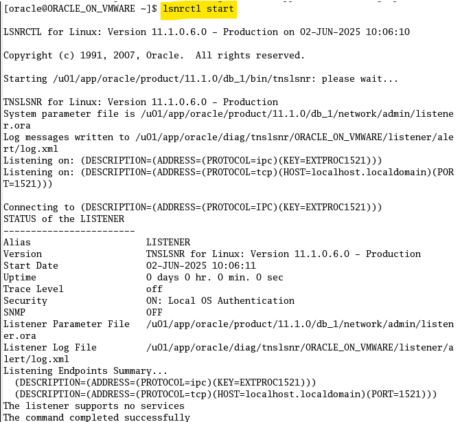
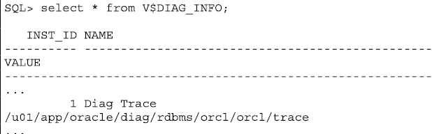

# Przygotowanie środowiska do ćwiczeń

## Maszyna wirtualna (VM) z systemem Linux

### 1.Zalogowaie się do maszyny wirtualnej (VM) z systemem Linux.

Login: `oracle`

Hasło: `oracle`

### 2. Uruchomienie w terminalu konsoli Enteprise Manager (jako user `oracle`):

```text
emctl start dbconsole
```

Uruchomienie w terminalu konsoli instancji orcl (jako user `oracle`):

```text
sqlplus / as sysdba
```
```text
sql>startup
```

Database opened.

```text
sql>exit
```


### 3. Uruchomienie w terminalu listenera (jako user `oracle`):

```text
lsnrctl start
```



### 4. Pobranie w trerminalu adresu IP maszyny wirtualnej (jako user `oracle`):

```text
su
```
```text
/sbin/dhclient
```

adres IP znajduje się w wierszu `bound to <adres_IP> -- renewal in <czas> seconds`.

```text
exit
```


# Oracle Database 11g: Ćwiczenia administracyjne

## Ćwiczenie 4-1: Zarządzanie instancją Oracle

### Krok 1: Logowanie do Oracle Enterprise Manager (EM)

1. Otwórz przeglądarkę w swoim komputerze (kliknij ikonę **Edge / Chrome** na pulpicie).

2. Wpisz URL w formacie:

`https://<hostname>:1158/em` (port `1158` z ćwiczenia 3).

3. Zaakceptuj certyfikat (wybierz *"Accept this certificate permanently"*).

4. Zaloguj się danymi:

- **User Name**: `sys`

- **Password**: `orcl`

- **Connect As**: `SYSDBA`

5. Kliknij **Login**.


### Krok 2: Zmiana parametru `JOB_QUEUE_PROCESSES`

1. Przejdź do: **Server** > **Initialization Parameters**.


2. W polu **Name** wpisz `job` i kliknij **Go**.


3. Zmień wartość `JOB_QUEUE_PROCESSES` na `15`.

4. Kliknij **Show SQL**, aby zobaczyć polecenie:


```sql

ALTER SYSTEM SET job_queue_processes = 15 SCOPE=MEMORY;

```

5. Kliknij **Return** a następnie **Apply**.


### Krok 3: Wyłączenie bazy danych (shutdown)

1. Na stronie głównej EM kliknij **Database** > **Shutdown**.


2. Wpisz dane hosta:

**Host Credentials:**
- **Username**: `oracle`

- **Password**: `oracle`


3. Kliknij **OK**.

4. Kliknij **Advanced Options** > upewnij się, że tryb to **Immediate** > **Cancel** > **Yes** (potwierdź shutdown).


5. Kliknij **Refresh**. Jeśli pojawią się błędy, kliknij **OK**.
6. Sprawdź status bazy w EM: powinna być **Down**.


### Krok 4: Sprawdzenie statusu bazy w SQL*Plus

1. Otwórz terminal Linux na VM.

2. Wpisz:

```text
sqlplus hr
```

3. Podaj hasło: `hr`.

4. **Spodziewany błąd**: `ORA-01034: ORACLE not available`.

5. Wciśnij **Ctr+D**, kiedy pojawi się **Enter user-name**.


### Krok 5: Ponowne uruchomienie bazy (startup)

1. W EM kliknij **Startup**.


2. Wpisz dane hosta

**Host Credentials:**
- **Username**: `oracle`
- **Password**: `oracle`

3. Kliknij **OK**.

3. Kliknij **Show SQL**, aby zobaczyć polecenie:

```sql
STARTUP;
```


4. Potwierdź operację klikając **Return** a następnie **Yes**.

### Krok 6: Analiza alert log

1. Pojawi się login page z prośbą o zalogowanie się ponownie.
- **User Name**: `SYS` 
- **Password**: `orcl` 
- **Connect As**: `SYSDBA`


1. W EM przejdź do: **Database** > **Related Links** > **Alert Log Contents**.


2. Kliknij **Go**.


3. Aby znaleźć lokalizację pliku alert log:

### Krok 1: Połącz się z bazą danych jako użytkownik `system` i hasło `orcl`:

```text

sqlplus system/orcl

```


### Krok 2. Wykonaj zapytanie:

```sql
SELECT * FROM V$DIAG_INFO;
```

Przykładowy wynik:
```text
INST_ID NAME                 VALUE
------- -------------------- -----------------------------------------------------------------
1      Diag Trace           /u01/app/oracle/diag/rdbms/orcl/orcl/trace
...    ...                  ...
```
```text
exit
```


### Krok 3. Zmień ścieżkę do katalogu `trace` na odpowiednią dla swojej instalacji.

W terminalu przejdź do katalogu `trace`:

```text
cd /u01/app/oracle/diag/rdbms/orcl/orcl/trace
```


### Krok 7: Sprawdzenie parametrów w SQL*Plus

1. Połącz się jako `sysdba`:

```text
sqlplus / as sysdba
```


2. Wykonaj polecenia:

```sql

SHOW PARAMETER sga_target;

SHOW PARAMETER pga_aggregate_target;

SHOW PARAMETER db_cache_size;

SHOW PARAMETER shared_pool_size;

SHOW PARAMETER job_queue_processes;

```


3. Sprawdź wartość `job_queue_processes`:

```text
SHOW PARAMETER job_queue_processes;
```

**Uwaga:** `job_queue_processes` wróci do wartości sprzed zmiany (np. `1000`), bo zmiana była tymczasowa (`SCOPE=MEMORY`).

---

# Ćwiczenie 5-1: Konfiguracja sieci Oracle w celu uzyskania dostępu do innej bazy danych

## Cel ćwiczenia
Skonfiguruj swoje środowisko sieciowe tak, aby móc połączyć się z bazą danych `orcl` partnera. Użyj lokalnego nazewnictwa (local naming) i utwórz nową nazwę usługi sieciowej o nazwie `testorcl`, która będzie mapowana na bazę danych `orcl` partnera. Przetestuj zmiany w sieci, próbując połączyć się z bazą danych partnera przy użyciu nazwy usługi `testorcl`.

## Krok 1 - **Wykonaj kopię zapasową plików `listener.ora` i `tnsnames.ora`.**  
   Znajdują się one w katalogu `$ORACLE_HOME/network/admin`.

## Polecenia do wykonania:
   a) W oknie terminala wpisz: 
```text
cd $ORACLE_HOME/network/admin
```
, aby przejść do katalogu `/u01/app/oracle/product/11.1.0/db_1/network/admin`

   b) Wpisz:
```text
cp listener.ora listener.old`
```

, aby utworzyć kopię pliku `listener.ora`.

   c) Wpisz:
```text
cp tnsnames.ora tnsnames.old
```   
, aby utworzyć kopię pliku `tnsnames.ora`.

   d) Wpisz:
```text
ls -l
```   
, jeśli chcesz zobaczyć kopie i ich uprawnienia w katalogu.

## Krok 2 - **Przejdź do strony Net Services Administration.**  
   Zacznij od kliknięcia linku **Listener** na stronie głównej bazy danych.

   a) Uruchom Enterprise Manager (EM) w przeglądarce, logując się:
   
- użytkownik `SYS`
- hasło `orcl`
- rola `SYSDBA`


   b) Na stronie głównej instancji bazy danych kliknij link **Listener** w sekcji **General**.


   c) W sekcji **Related Links** kliknij **Net Services Administration**.

## Krok 3 - **Zmodyfikuj plik rozpoznawania nazw (Local Names Resolution)**
, aby umożliwić połączenie z inną bazą danych.  
   Nazwij połączenie do bazy danych `orcl` partnera jako `testorcl`.

a) Na stronie **Net Services Administration**:
- Wybierz **Local Naming** z listy rozwijanej Administer
- Kliknij **Go**


b) **Logowanie do hosta**:
- Jeśli wcześniej zapisałeś dane logowania (`oracle`/`oracle`), będą widoczne
- Jeśli nie:
    - **Username**: `oracle`
    - **Password**: `oracle`
    - Zaznacz **Save as Preferred Credential**
    - Kliknij **Login**


c) Na stronie **Local Naming**:
- Kliknij **Create** (utwórz nową nazwę usługi sieciowej)


d) **Konfiguracja nowej usługi**:
- **Net Service Name**: `testorcl`

e) **Definicja połączenia**:
- Wybierz **Use Service Name**
- Wpisz **Service Name**: `orcl.oracle.com`

**Uwaga:** Możesz też użyć SID zamiast Service Name:
- Wybierz **Use SID**
- Wpisz **SID**: `orcl`

f) **Wybierz** `Database Default`


g) Kliknij **Add** w sekcji **Addresses**.
Kliknij **No**, jeśli pojawi się komunikat "Do you want to remember the values you filled in?".

h) W sekcji **Add Adress**: wybierz:
- **Protocol**: `TCP/IP`
- **Port**: `1521`
- **Host**: adres IP lub nazwa hosta partnera (np. `edrsrl2pl.us.oracle.com` lub `139.185.35.112`)


i) Kliknij **OK**. **OK** ponownie, aby zapisać zmiany.

## Krok 4 - **Test połączenia z nową usługą**

4) **Przetestuj dostęp do bazy partnera w Enterprise Manager**  
   Użyj nazwy usługi `testorcl`, aby połączyć się jako użytkownik `system` z hasłem `oracle`.

a) Na stronie **Local Naming**:
- Wybierz `testorcl`
- Kliknij **Test Connection**
- Pojawi się okno: *"Test Connection To Net Service Name: testorcl"*


b) Wprowadź dane logowania:
- **Username**: `system`
- **Password**: `oracle`
- Kliknij **Test**

c) Oczekiwany wynik:
- *"The test was successful"*
- Jeśli są błędy - rozwiąż je

> Kliknij **OK** po zakończeniu testu.

## Krok 5 - **Test połączenia w SQL*Plus**

5) **Przetestuj konfigurację sieci w SQL*Plus**  
Użyj polecenia: `system/oracle@testorcl`

a) W terminalu wpisz:
```text
sqlplus system/oracle@testorcl
```

b) Po pomyślnym połączeniu wykonaj zapytanie:
```sql
SELECT instance_name, host_name FROM v$instance;
```

c) **Oczekiwany wynik**:  
   
Wyświetlą się dane partnera, np:
      
```
INSTANCE_NAME
-------------
HOST_NAME
--------------------
orcl
partner-server.example.com
```

d) Jeśli pojawią się błędy - rozwiąż je

# Ćwiczenie 5-2: Tworzenie alternatywnego listenera

W tym ćwiczeniu utworzysz drugi listener, który może być używany do obsługi przełączania awaryjnego podczas połączenia (connect-time failover).

1) **Przygotowanie środowiska:**
   
a) Wyloguj się z Enterprise Manager.

b) Uruchom skrypt `lab_05_02_01.sh` w terminalu systemu operacyjnego:

```text
./lab_05_02_01.sh
```

*Skrypt konfiguruje plik NetProperties, umożliwiając konfigurację listenera przez EM.*

c) Zaloguj się ponownie do Enterprise Manager jako
- użytkownik `SYS`
- z rolą `SYSDBA` 
- dla bazy `orcl`

2) **Utwórz nowy listener `LISTENER2`:**

a) W EM: Kliknij **Listener** w sekcji **General** na stronie głównej instancji bazy.

b) W sekcji **Related Links** kliknij **Net Services Administration**.

c) Na stronie Net Services Administration:

- Wybierz **Listeners** z listy rozwijanej Administer
- Kliknij **Go**
- Wprowadź dane hosta: **Username**: `oracle`, **Password**: `oracle`
- Kliknij **Login**

d) Na stronie **Listeners** (przegląd istniejących listenerów) kliknij **Create**.

e) **Konfiguracja nowego listenera:**
- **Listener Name**: `LISTENER2`
- Kliknij **Add** (dodaj adres listenera)

f) Wprowadź wartości:

   | Opcja       | Wartość                                  |
   |-------------|------------------------------------------|
   | Protocol    | TCP/IP                                   |
   | Port        | 1561                                     |
   | Host        | `<adres_ip_hosta>` (np. 192.168.228.128) |

Sprawdzenie adresu IP:

```text
su
/sbin/dhclient
```

znajduje się on w wierszu `bound to <adres_IP> -- renewal in <czas> seconds`.

g) Kliknij **OK**.

h) Kliknij **Static Database Registration**.

i) Kliknij przycisk **Add** (Dodaj), aby połączyć nowy listener z Twoją bazą danych `orcl`.

j) Wprowadź następujące wartości:

| Opcja                      | Wartość                                |
|----------------------------|----------------------------------------|
| Service Name               | `orcl`                                 |
| Oracle Home Directory      | `/u01/app/oracle/product/11.1.0/db_1`  |
| Oracle System Identifier (SID) | `orcl`                             |

### Przykładowy formularz:

**Add Database Service**

- **Service Name**: `orcl`

- **Oracle Home Directory**: `/u01/app/oracle/product/11.1.0/db_1`

- **Oracle System Identifier (SID)**: `orcl`

k) Kliknij **OK**, aby dodać usługę bazy danych.

l) Kliknij **OK**, aby utworzyć listener `LISTENER2`.

```
## Wyjaśnienie konfiguracji:

| Pole                     | Znaczenie                                                                 |
|--------------------------|---------------------------------------------------------------------------|
| **Service Name**         | Nazwa usługi bazy danych, pod którą będzie dostępna przez listenera      |

| **Oracle Home Directory** | Ścieżka do katalogu instalacyjnego Oracle (musi być poprawna!)           |

| **SID**                  | System Identifier - unikalny identyfikator instancji bazy danych          |

## Co się dzieje w tle?

Po zatwierdzeniu, w pliku `listener.ora` zostanie dodana sekcja:

```ini

SID_LIST_LISTENER2 =

(SID_LIST =

(SID_DESC =

(SID_NAME = orcl)

(ORACLE_HOME = /u01/app/oracle/product/11.1.0/db_1)

(GLOBAL_DBNAME = orcl)

)

)

```

## Dlaczego to ważne?

- **Statyczna rejestracja** wymagana jest dla:

- Łączenia się gdy baza nie jest uruchomiona

- Narzędzi zewnętrznych (np. SQL*Plus przed startem bazy)

- Kompatybilności wstecznej z starszymi wersjami

- **Dynamiczna rejestracja** (LREG) działa tylko gdy baza jest uruchomiona

## Weryfikacja konfiguracji:

Po utworzeniu listenera sprawdź plik `listener.ora`:

```bash

cat $ORACLE_HOME/network/admin/listener.ora

```

Oczekiwana zawartość:

```ini

# ... istniejące wpisy ...

LISTENER2 =

(DESCRIPTION_LIST =

(DESCRIPTION =

(ADDRESS = (PROTOCOL = TCP)(HOST = twój_host)(PORT = 1561))

)

SID_LIST_LISTENER2 =

(SID_LIST =

(SID_DESC =

(SID_NAME = orcl)

(ORACLE_HOME = /u01/app/oracle/product/11.1.0/db_1)

(GLOBAL_DBNAME = orcl)

)

)

```

### Diagram procesu tworzenia listenera:


# Ćwiczenie 5-2: Tworzenie alternatywnego listenera (cd.)

3) **Uruchom listenera LISTENER2:**

a) W interfejsie Enterprise Manager:
- Zaznacz listener **LISTENER2**
- Wybierz akcję **Start/Stop** z listy rozwijanej Actions
- Kliknij **Go**

b) Na stronie **Start/Stop**:
- Kliknij **OK**
- Pojawi się potwierdzenie z linkiem **View Details**

c) Opcjonalnie:
- Kliknij **View Details** aby sprawdzić status
- Użyj przycisku **Back** w przeglądarce aby wrócić

4) **Zatrzymaj domyślnego listenera i przetestuj nowy:**

a) W terminalu wykonaj polecenia:

```text
# Zatrzymaj domyślnego listenera
lsnrctl stop
   
# Sprawdź status (powinien być wyłączony)
lsnrctl status
   
# Sprawdź status nowego listenera
lsnrctl status LISTENER2
```
    
b) Połącz się z bazą przez nowego listenera:
```text
sqlplus hr/hr@twój_adres_ip:1561/orcl
```

Uwaga: Połączenie przechodzi przez nowo utworzonego listenera

Po wykonaniu testu wyjdź z SQL*Plus: EXIT

c) Uruchom ponownie domyślnego listenera:
```text
lsnrctl start LISTENER
```

## Wyjaśnienie kluczowych poleceń:

| Polecenie | Opis | Przykładowe użycie |
|-----------|------|--------------------|
| `lsnrctl stop` | Zatrzymuje domyślnego listenera | `lsnrctl stop` |
| `lsnrctl status` | Pokazuje status listenera | `lsnrctl status LISTENER` |
| `lsnrctl status LISTENER2` | Sprawdza status alternatywnego listenera | `lsnrctl status LISTENER2` |
| `lsnrctl start` | Uruchamia listenera | `lsnrctl start LISTENER` |
| `sqlplus hr/hr@...` | Łączy z bazą przez określony port | `sqlplus hr/hr@192.168.1.100:1561/orcl` |

## Diagram testowania połączenia:

```mermaid
sequenceDiagram
    participant U as Użytkownik
    participant T as Terminal
    participant L2 as LISTENER2
    participant DB as Baza danych
    
    U->>T: lsnrctl stop (LISTENER)
    U->>T: lsnrctl status LISTENER2
    T->>L2: Status request
    L2-->>T: Status: RUNNING
    U->>T: sqlplus hr/hr@ip:1561/orcl
    T->>L2: Żądanie połączenia
    L2->>DB: Przekazanie połączenia
    DB-->>L2: Potwierdzenie
    L2-->>T: Połączenie udane
    U->>T: EXIT (zakończ sesję)
    U->>T: lsnrctl start LISTENER


