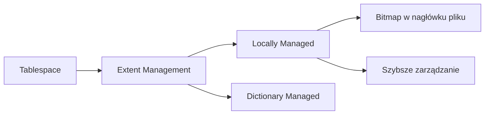

# Oracle Database 11g: Ćwiczenia administracyjne - Laboratorium 6

## Ćwiczenie 6-1: Przeglądanie informacji o strukturze przechowywania danych

### Krok 1: Utworzenie użytkownika DBA1

1. Uruchom skrypt `lab_06_01.sh`:

```bash

cd /home/oracle/labs

./lab_06_01.sh

```

- Skrypt tworzy użytkownika `DBA1` z hasłem `oracle`

### Krok 2: Konfiguracja DBA1 w Enterprise Manager

1. W EM:

- Kliknij **Setup** (prawy górny róg)

- Wybierz **Administrators** > **Create**

2. Wprowadź dane:

- **Name**: `dba1`

- **Password**: `oracle`

- **Confirm Password**: `oracle`

- Zostaw **Super Administrator** zaznaczone

3. Kliknij **Finish**

4. Wyloguj się z EM i zaloguj ponownie jako:

- **User Name**: `dba1`

- **Password**: `oracle`

- **Connect As**: `SYSDBA`

### Krok 3: Analiza przestrzeni tabel EXAMPLE

1. W EM: **Server** > **Storage** > **Tablespaces** > **EXAMPLE**

2. Odpowiedz na pytania:

**Pytanie 1**: Jaki procent wolnej przestrzeni uruchamia ostrzeżenie?

**Odpowiedź**: 85%

*(Znajdź w sekcji "Tablespace Full Metric Thresholds")*

**Pytanie 2**: Ile segmentów znajduje się w przestrzeni EXAMPLE?

**Odpowiedź**: 418 (wartość może się różnić)

- **Actions** > **Show Tablespace Contents** > **Go**

**Pytanie 3**: Który indeks zajmuje najwięcej miejsca?

**Odpowiedź**: `SH.CUSTOMERS_PK` (1024 KB)

- Filtruj typ: **INDEX**

- Sortuj po kolumnie **Size (KB)** (malejąco)

**Pytanie 4**: Który segment jest przechowywany fizycznie jako pierwszy?

**Odpowiedź**: `HR.REGIONS`

- Przewiń do **Extent Map**

- Różowy blok to nagłówek przestrzeni tabel

- Pierwszy segment po nagłówku to `HR.REGIONS`

---

## Ćwiczenie 6-2: Tworzenie przestrzeni tabel

### Krok 1: Utworzenie przestrzeni INVENTORY (5 MB)

1. W EM: **Server** > **Storage** > **Tablespaces** > **Create**

2. Ustawienia:

- **Name**: `INVENTORY`

- **Extent Management**: Locally Managed

- **Type**: Permanent

- **Status**: Read Write

- **Bigfile tablespace**: Niezaznaczone

3. Dodaj plik danych:

- **Add Datafile** > **File Name**: `inventory01.dbf`

- **File Size**: `5 MB`

4. Zakładka **Storage**:

- **Extent Allocation**: Automatic

- **Segment Space Management**: Automatic

- **Compression**: Disabled

- **Logging**: Yes

5. Zatwierdź: **Show SQL** > **OK**

### Krok 2: Test pojemności przestrzeni

1. Uruchom skrypt jako `dba1`:

```bash

cd /home/oracle/labs

sqlplus dba1/oracle @lab_06_02_02.sql

```

2. **Oczekiwany błąd**:

`ORA-01653: unable to extend table DBA1.X by 128 in tablespace INVENTORY`

### Krok 3: Rozszerzenie przestrzeni do 72 MB

1. W EM: Edytuj przestrzeń `INVENTORY`

- **Edit Datafile** > Zmień rozmiar z `5 MB` na `72 MB`

2. Sprawdź generowane polecenie SQL:

```sql

ALTER DATABASE DATAFILE '/u01/app/oracle/oradata/orcl/inventory01.dbf' RESIZE 72M

```

3. Zatwierdź zmiany: **Apply**

### Krok 4: Ponowny test i sprzątanie

1. Uruchom skrypty czyszczące i testowe:

```bash

sqlplus dba1/oracle @lab_06_02_04.sql  # Powtarza test bez błędów

sqlplus dba1/oracle @lab_06_02_05.sql  # Czyszczenie

```

# Kluczowe koncepcje
## Lokalne zarządzanie przestrzenią tabel (Locally Managed Tablespaces)



## Typowe błędy i rozwiązania

| Błąd | Przyczyna | Rozwiązanie |
|------|-----------|-------------|
| ORA-01653 | Brak miejsca w przestrzeni tabel | Zwiększ rozmiar pliku danych lub dodaj nowy |
| ORA-01950 | Brak uprawnień do przestrzeni | Nadaj kwotę: `ALTER USER ... QUOTA UNLIMITED ON ...` |
| ORA-00959 | Przestrzeń tabel już istnieje | Użyj innej nazwy lub usuń istniejącą |

